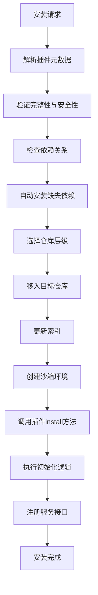
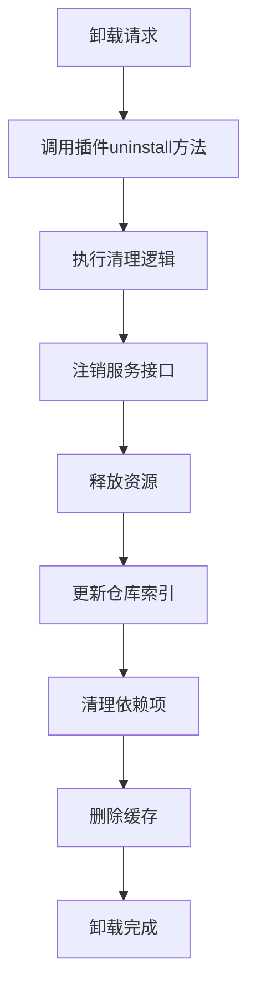

### 安装与卸载接口的设计原因及实现逻辑

在 Flask 插件系统中，**安装接口**（`install`）和**卸载接口**（`uninstall`）的设计是插件生命周期管理的关键环节。它们的存在与实现逻辑需从 **系统稳定性、资源控制、依赖管理** 三个维度理解，以下是详细分析：

---

#### **一、为什么需要安装与卸载接口？**

1. **系统稳定性保障**
   - **文档依据**：生命周期流程中要求“解析依赖”和“评估资源需求”（[插件生命周期流程](file://d:\projects\python\flask_plugins\docs\design\20250601.md#插件生命周期流程)）。
   - **目的**：  
     安装与卸载接口确保插件在加入或移除系统时，能够：
     - **安装时**：完成依赖项的验证与安装，配置运行环境（如沙箱隔离策略）。
     - **卸载时**：释放资源（如内存、文件锁），避免残留数据导致后续冲突。

2. **资源控制与隔离**
   - **文档依据**：沙箱代理的隔离级别设计（[沙箱代理](file://d:\projects\python\flask_plugins\docs\design\20250601.md#沙箱代理sandbix-agent)）。
   - **目的**：  
     安装接口需支持根据插件声明的隔离级别（进程/线程/模块级）动态创建沙箱环境，卸载时需确保资源被安全回收（如终止子进程、释放线程资源）。

3. **依赖管理与版本控制**
   - **文档依据**：仓库维护流程中的版本冲突解决（[仓库维护和版本管理流程](file://d:\projects\python\flask_plugins\docs\design\20250601.md#仓库维护和版本管理流程)）。
   - **目的**：  
     安装接口需触发依赖解析（如自动下载依赖插件），卸载接口需通知系统清理不再需要的依赖版本，避免仓库膨胀或版本冲突。

4. **多加载方式适配**
   - **文档依据**：插件按加载方式分为内置、静态编码、动态加载等（[按加载方式划分](file://d:\projects\python\flask_plugins\docs\design\20250601.md#按加载方式划分)）。
   - **目的**：  
     不同加载方式的插件（如远程插件、REST 接口形式插件）需通过接口实现自定义安装/卸载逻辑，例如：
     - **远程插件**：安装时从远程仓库下载并验证完整性。
     - **REST 插件**：卸载时关闭对应的远程服务连接。

5. **分布式协作支持**
   - **文档依据**：Worker 自发现机制要求同步节点状态（[Worker 自发现机制](file://d:\projects\python\flask_plugins\docs\design\20250601.md#worker自发现机制)）。
   - **目的**：  
     安装接口需通知主节点更新全局状态文件，卸载接口需触发跨 Worker 的状态同步（如清理其他节点的缓存引用）。

---

#### **二、安装接口（`install`）的职责与实现逻辑**

##### **1. 核心职责**
- **依赖解析与验证**  
  确保插件所需的依赖项（其他插件、Python 版本、操作系统）已满足。
- **资源分配**  
  根据插件声明的资源需求（CPU、内存上限）分配沙箱环境。
- **元数据注册**  
  将插件信息（ID、版本、能力）写入仓库索引（如 `plugins.json`）。
- **环境初始化**  
  配置插件的运行时环境（如日志路径、临时文件目录）。
- **服务注册**  
  将插件提供的功能接口（如 HTTP 路由、数据处理服务）注册到系统。

##### **2. 实现逻辑**


##### **3. 典型操作**
- **依赖检查**  
  ```python
  def check_dependencies(self) -> bool:
      # 检查依赖插件是否存在，版本是否兼容
      for dep in self.metadata.get("dependencies", []):
          if not self._dependency_resolver.resolve(dep):
              return False
      return True
  ```
- **资源分配**  
  ```python
  def allocate_resources(self) -> bool:
      # 根据插件声明的资源需求分配内存、CPU 配额
      if not self._sandbox.allocate(self.metadata["resources"]):
          return False
      return True
  ```
- **服务注册**  
  ```python
  def register_services(self) -> None:
      # 将插件提供的接口（如 HTTP 路由）注入系统
      for interface in self.metadata["interfaces"]["provides"]:
          self._registry.register(interface, self)
  ```

---

#### **三、卸载接口（`uninstall`）的职责与实现逻辑**

##### **1. 核心职责**
- **依赖清理**  
  移除插件的依赖项（如第三方库），避免版本冲突。
- **资源释放**  
  终止沙箱环境（如关闭子进程、释放线程资源）。
- **状态同步**  
  更新插件状态至“已卸载”，通知所有 Worker 清理缓存引用。
- **服务注销**  
  移除插件注册的功能接口（如 HTTP 路由、事件监听器）。
- **数据清理**  
  删除插件生成的临时文件或持久化数据。

##### **2. 实现逻辑**


##### **3. 典型操作**
- **服务注销**  
  ```python
  def unregister_services(self) -> None:
      # 移除插件提供的所有接口注册
      for interface in self.metadata["interfaces"]["provides"]:
          self._registry.unregister(interface, self.id)
  ```
- **资源释放**  
  ```python
  def release_resources(self) -> None:
      # 终止沙箱中的进程/线程，释放内存
      self._sandbox.release(self.id)
  ```
- **依赖清理**  
  ```python
  def cleanup_dependencies(self) -> None:
      # 卸载插件依赖的其他插件（如无其他插件依赖）
      for dep in self.metadata.get("dependencies", []):
          if not self._dependency_resolver.is_used_by_other_plugins(dep):
              self._repository.uninstall(dep)
  ```

---

#### **四、与系统模块的协作关系**

| **接口功能**       | **协作模块**        | **协作逻辑**                                                                 |
|--------------------|---------------------|-----------------------------------------------------------------------------|
| 安装接口           | `Repository.loader`  | 解析依赖并调用 `install` 方法，完成插件包的存储和索引更新。                      |
| 卸载接口           | `Registry.lifecycle` | 调用 `uninstall` 方法后，从仓库中移除插件并更新索引。                          |
| 安装接口           | `Sandbox`           | 创建沙箱环境时调用插件的 `install` 方法配置资源限制和安全策略。                   |
| 卸载接口           | `Bus.dispatcher`     | 卸载时清理插件注册的路由规则，避免消息发送至已卸载插件。                        |
| 安装/卸载接口      | `Discovery.sync`     | 在主节点选举后同步插件状态至所有 Worker（如主节点卸载后通知从节点清理缓存）。      |

---

#### **五、典型场景示例**

1. **安装远程插件**  
   - **触发**：用户上传插件包（如 `plugin_3/1.0.0`）。
   - **流程**：
     - `Repository` 调用插件的 `install` 方法。
     - 插件验证依赖（如 `plugin_2>=1.0.0`）并自动安装。
     - 配置沙箱资源（如限制内存为 `512MB`）。
     - 注册 HTTP 路由 `/api/v1/plugin3`。
     - `Registry` 更新仓库索引，`Discovery` 同步状态至所有 Worker。

2. **卸载故障插件**  
   - **触发**：插件因资源超限被隔离（如内存占用超过 `resources.memory_limit`）。
   - **流程**：
     - `Sandbox` 调用插件的 `uninstall` 方法。
     - 插件注销 `/api/v1/plugin3` 路由。
     - 释放沙箱中的进程和线程资源。
     - 清理依赖项（如无其他插件依赖 `plugin_2` 则卸载）。
     - `Repository` 更新索引并删除插件文件。

---

#### **六、设计优势**
- **灵活性**  
  插件可自定义安装/卸载逻辑（如数据库迁移、硬件绑定），适应不同场景。
- **安全性**  
  通过接口强制执行资源回收，避免内存泄漏或权限残留。
- **可扩展性**  
  支持多加载方式（如远程插件、REST 接口插件）的差异化处理。
- **分布式一致性**  
  安装/卸载操作通过接口触发后，自动同步至所有 Worker 节点。

---

### **总结**
安装与卸载接口的设计直接服务于插件系统的 **稳定性、资源控制、依赖管理和分布式协作** 目标：
- **安装接口**：确保插件在加入系统时完成依赖验证、资源分配和服务注册。
- **卸载接口**：保证插件移除时释放资源、清理依赖并同步状态。

这种设计既解耦了核心模块与插件逻辑，又为多类型插件提供了统一的扩展点，是插件系统实现 **灵活、安全、可扩展** 的关键支撑。