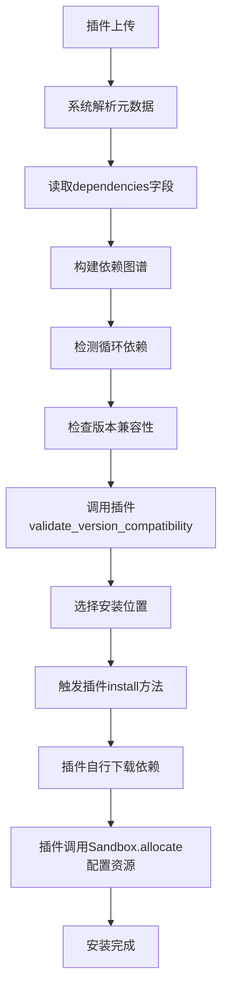

### 依赖信息与版本兼容信息的设计逻辑：系统与插件的职责分工

在 Flask 插件系统中，**依赖关系查询** 和 **版本兼容性验证** 接口的设计看似与插件自主管理依赖的逻辑矛盾，实则体现了 **系统与插件之间的协作机制**。这种设计并非重复劳动，而是基于 **职责边界划分** 和 **机制与策略分离** 的核心理念（[系统概述](file://d:\projects\python\flask_plugins\docs\design\20250601.md#系统概述)），以下是详细分析：

---

#### **一、为什么插件需要向系统提供依赖信息？**

1. **系统级协调依赖管理**
   - **文档依据**：生命周期流程中的“依赖分析”阶段需解析依赖图谱（[插件生命周期流程](file://d:\projects\python\flask_plugins\docs\design\20250601.md#插件生命周期流程)）。
   - **目的**：  
     系统需要插件声明的依赖信息，用于：
     - **全局依赖解析**：构建完整的依赖图谱，避免循环依赖或版本冲突。
     - **资源调度**：根据依赖关系决定插件的执行顺序（如先安装 `plugin_A` 再加载依赖它的 `plugin_B`）。
     - **分布式同步**：主节点通过依赖信息确保所有 Worker 安装相同版本的依赖插件。

2. **多版本共存的管理**
   - **文档依据**：版本管理机制支持多版本并存（[版本管理机制](file://d:\projects\python\flask_plugins\docs\design\20250601.md#版本管理机制)）。
   - **目的**：  
     系统需通过插件声明的版本需求（如 `>=1.0.0`），决定：
     - **优先加载哪个版本**（如 `latest-stable` 或 `latest`）。
     - **版本冲突检测**（如 `plugin_A` 依赖 `plugin_B@v1.0`，但 `plugin_C` 依赖 `plugin_B@v2.0`）。
     - **版本回滚策略**（如升级失败时切换回兼容版本）。

3. **隔离级别的适配**
   - **文档依据**：沙箱代理的隔离级别设计（[沙箱代理](file://d:\projects\python\flask_plugins\docs\design\20250601.md#沙箱代理sandbix-agent)）。
   - **目的**：  
     系统需根据插件声明的依赖类型（如第三方库、其他插件）动态调整隔离策略：
     - **进程级隔离**：资源密集型依赖需独立进程。
     - **线程级隔离**：轻量级依赖共享内存。
     - **模块级隔离**：完全可信依赖直接加载。

4. **分布式一致性保障**
   - **文档依据**：Worker 自发现机制需同步节点状态（[Worker 自发现机制](file://d:\projects\python\flask_plugins\docs\design\20250601.md#worker自发现机制)）。
   - **目的**：  
     系统需通过依赖信息确保：
     - **跨 Worker 兼容**：主节点同步依赖版本至所有从节点。
     - **缓存一致性**：远程插件下载的版本与本地缓存匹配。

---

#### **二、系统与插件的职责划分**

| **职责维度**       | **系统职责**                                | **插件职责**                                |
|--------------------|---------------------------------------------|---------------------------------------------|
| **依赖声明**       | 读取插件元数据中的依赖项（如 `dependencies`） | 在元数据中明确声明依赖关系（如 `plugin_B@>=1.0.0`） |
| **依赖解析**       | 构建全局依赖图谱，检测循环依赖                | 提供依赖信息供系统解析                        |
| **版本选择**       | 根据策略选择兼容版本（如优先最新稳定版）        | 实现版本兼容性验证逻辑（如自定义版本匹配规则）   |
| **依赖安装**       | 协调安装顺序，触发插件的 `install` 方法        | 实现具体的依赖安装逻辑（如下载、配置沙箱）     |
| **版本冲突解决**   | 触发冲突解决流程（如回滚或手动干预）          | 提供版本回滚逻辑（如数据迁移脚本）            |

---

#### **三、典型协作流程示例**

---

#### **四、设计对比：仅由系统管理 vs 仅由插件管理**

| **场景**               | **仅由系统管理依赖**                          | **仅由插件管理依赖**                          | **当前设计（协作模式）**                      |
|------------------------|----------------------------------------------|----------------------------------------------|--------------------------------------------|
| **依赖声明**           | 系统需硬编码所有插件的依赖关系                | 插件自行维护依赖信息                          | 插件提供依赖信息，系统解析并协调             |
| **版本冲突检测**       | 系统无法预知插件内部版本需求                  | 插件自行检测，但跨插件冲突难处理              | 系统构建全局图谱，插件验证本地版本兼容性     |
| **资源调度**           | 系统无法预知插件的具体资源需求                | 插件需自行申请资源                            | 系统按插件声明的资源需求分配沙箱            |
| **分布式一致性**       | 系统需额外实现 Worker 间依赖同步              | 插件需自行实现同步逻辑                        | 系统触发同步，插件提供版本信息              |

---

#### **五、设计优势总结**

1. **职责清晰**  
   - 系统负责 **全局协调**（如依赖图谱、版本冲突、资源调度）。
   - 插件负责 **具体执行**（如下载依赖、配置沙箱、数据迁移）。

2. **灵活性与扩展性**  
   - 插件可自定义依赖解析逻辑（如从 CDN 下载依赖）。
   - 系统无需修改即可支持新依赖类型（如硬件驱动、数据库连接池）。

3. **安全性与稳定性**  
   - 系统强制执行版本一致性（如拒绝不兼容版本进入仓库）。
   - 插件按需申请资源（如内存、CPU 配额）。

4. **分布式协作效率**  
   - 系统通过插件提供的依赖信息，集中管理 Worker 的依赖状态同步。

---

### **结论**
依赖信息与版本兼容性接口的设计本质是 **系统与插件协作的桥梁**：
- **插件**：提供依赖项声明和版本兼容性验证逻辑（如 `dependencies` 字段、`validate_version_compatibility` 方法）。
- **系统**：基于插件提供的信息，执行全局协调（如依赖图谱构建、资源调度、版本冲突检测）。

这种设计既避免了系统模块因插件逻辑膨胀，又确保了插件的灵活性和系统的稳定性，完全符合文档中“插件是职责边界”的核心思想（[系统概述](file://d:\projects\python\flask_plugins\docs\design\20250601.md#系统概述)）。