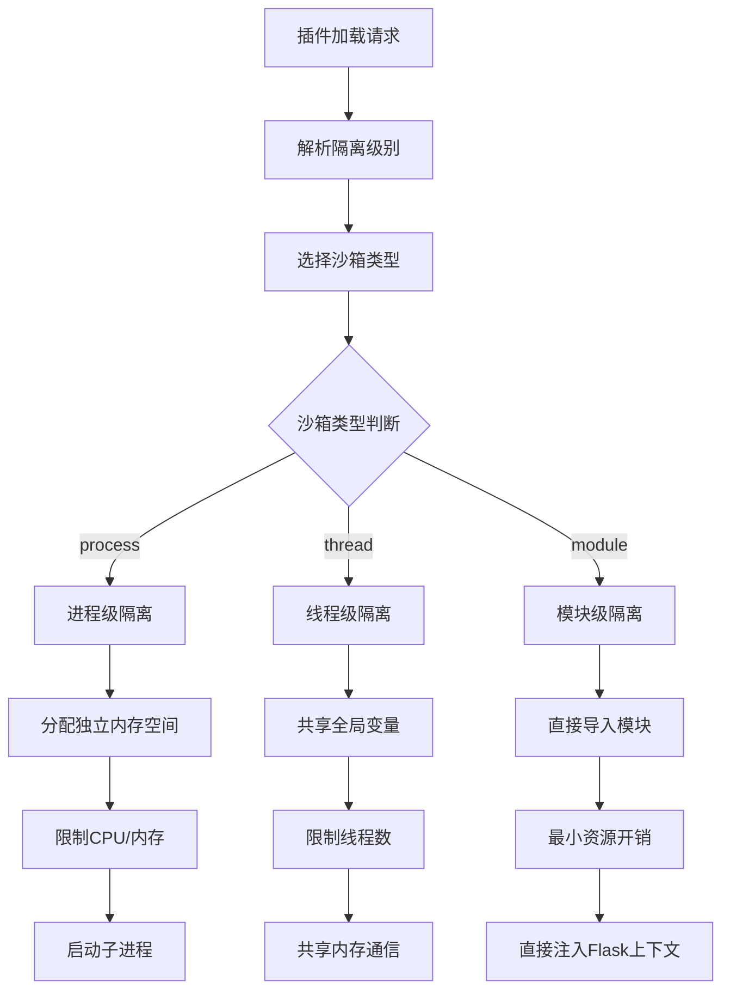

### 对外接口中资源管理接口的设计原因

在 Flask 插件系统中，**权限与资源限制** 和 **隔离级别适配** 是资源管理接口的核心设计点。这两个功能的引入并非孤立存在，而是服务于 **安全性、资源控制、分布式协作** 三大目标。其背后的设计逻辑可从以下维度深入剖析：

---

#### **一、权限与资源限制**
##### **设计原因**
1. **安全边界控制**
   - **文档依据**：沙箱代理的安全特性中明确要求“资源访问控制”和“权限管理”（[沙箱代理](file://d:\projects\python\flask_plugins\docs\design\20250601.md#沙箱代理sandbix-agent)）。
   - **目的**：  
     通过接口声明权限（如 `file_read`、`network_access`），系统可以：
     - **限制访问路径**（如禁止读取 `/etc`、`/sys`）。
     - **控制网络行为**（如仅允许连接 `api.example.com` 的 80/443 端口）。
     - **执行最小权限原则**（如拒绝 `can_spawn_process` 防止插件创建子进程）。

2. **资源配额管理**
   - **文档依据**：资源需求字段要求声明 CPU、内存、磁盘上限（[插件元数据结构](file://d:\projects\python\flask_plugins\docs\design\20250601.md#插件元数据结构)）。
   - **目的**：  
     接口需支持插件声明资源限制（如 `max_cpu:50%`、`max_memory:1GB`），系统根据这些信息：
     - **动态分配资源**（如进程级隔离插件独占 512MB 内存）。
     - **防止单点过载**（如限制插件最多打开 100 个文件）。
     - **监控资源使用**（如记录 `resources.cpu_usage`、`memory_usage`）。

3. **策略与机制分离**
   - **文档依据**：核心思想强调“基于机制而非策略的设计”（[设计理念](file://d:\projects\python\flask_plugins\docs\design\20250601.md#设计理念)）。
   - **目的**：  
     权限与资源限制接口提供标准化的 **声明机制**（如插件通过 `permissions` 字段声明所需权限），而系统的沙箱代理负责 **执行策略**（如强制限制 `max_connections` 为 10）。

4. **多加载方式适配**
   - **文档依据**：插件按加载方式分为内置、动态加载、远程传输等（[按加载方式划分](file://d:\projects\python\flask_plugins\docs\design\20250601.md#按加载方式划分)）。
   - **目的**：  
     不同加载方式的插件需差异化管理资源：
     - **内置插件**：高权限（如允许修改文件）。
     - **远程插件**：低权限（如禁止访问系统文件）。
     - **REST 接口插件**：仅允许协议适配（如禁止本地执行）。

##### **典型操作**
- **声明权限**  
  ```python
  def get_permissions(self) -> List[str]:
      return self.metadata.get("permissions", [])
  ```
- **执行限制**  
  ```python
  def enforce_resource_limits(self, limits: Dict[str, str]) -> bool:
      # 根据沙箱类型执行资源限制（如进程级限制内存）
      return self._sandbox.apply_limits(self.id, limits)
  ```

---

#### **二、隔离级别适配**
##### **设计原因**
1. **资源隔离与安全性**
   - **文档依据**：沙箱代理的隔离级别设计（[隔离级别设计](file://d:\projects\python\flask_plugins\docs\design\20250601.md#隔离级别设计)）。
   - **目的**：  
     通过接口声明隔离级别（如 `sandbox_type:process`），系统可：
     - **动态切换隔离模式**（如高风险插件使用进程级隔离，轻量级插件使用线程级）。
     - **执行资源回收**（如进程级插件崩溃后自动终止子进程）。
     - **限制交互方式**（如模块级插件仅能共享内存通信）。

2. **性能与开销平衡**
   - **文档依据**：隔离级别的优缺点对比（[进程级隔离](file://d:\projects\python\flask_plugins\docs\design\20250601.md#进程级隔离) vs [线程级隔离](file://d:\projects\python\flask_plugins\docs\design\20250601.md#线程级隔离)）。
   - **目的**：  
     接口需支持根据插件类型选择隔离级别：
     - **可信插件**（如内置插件）：使用模块级隔离（最小开销）。
     - **轻量级插件**（如运维工具）：使用线程级隔离（快速启动）。
     - **高风险插件**（如第三方代码）：使用进程级隔离（最强安全保障）。

3. **分布式协作效率**
   - **文档依据**：总线池概念需协调跨 Worker 的资源使用（[通信总线](file://d:\projects\python\flask_plugins\docs\design\20250601.md#通信总线)）。
   - **目的**：  
     隔离级别适配接口需确保：
     - **跨 Worker 资源一致性**（如所有节点的沙箱类型匹配）。
     - **通信效率优化**（如线程级插件共享内存通信，进程级插件使用 TCP）。

4. **系统独立性保障**
   - **文档依据**：系统设计核心在于运行机制而非框架（[框架独立性](file://d:\projects\python\flask_plugins\docs\design\20250601.md#框架独立性)）。
   - **目的**：  
     隔离级别适配接口确保系统不依赖 Flask 的请求响应机制，而是通过沙箱代理实现：
     - **进程级隔离**：独立于 Flask 运行时（插件崩溃不影响主进程）。
     - **线程级隔离**：与 Flask 的 Gunicorn 多 Worker 兼容。
     - **模块级隔离**：直接嵌入 Flask 应用上下文（如中间件插件）。

##### **典型协作流程**


---

#### **三、系统与插件的协作关系**

| **接口功能**         | **协作模块**        | **协作逻辑**                                                                 |
|----------------------|---------------------|-----------------------------------------------------------------------------|
| 权限与资源限制       | `Sandbox.security`   | 插件声明权限需求（如 `network_access`），沙箱代理强制执行访问控制。                |
| 隔离级别适配         | `Sandbox`           | 插件声明 `sandbox_type`，系统根据类型选择隔离策略（如进程级调用 `multiprocessing`）。 |
| 权限验证             | `Registry.lifecycle` | 在插件启动前检查权限是否满足沙箱策略（如禁止访问 `/etc` 的插件加载）。              |
| 资源回收             | `Sandbox`           | 插件卸载时调用接口释放资源（如终止子进程、回收内存）。                          |

---

#### **四、设计对比：统一管理 vs 协作模式**

| **对比维度**         | **统一资源管理**                     | **协作模式（当前设计）**                      |
|----------------------|------------------------------------|--------------------------------------------|
| **权限控制**         | 系统硬编码权限规则                 | 插件声明权限，系统按需验证                  |
| **资源限制**         | 系统预设所有资源限制               | 插件按需申请资源（如 GPU 插件申请显存）     |
| **隔离级别选择**     | 系统决定所有插件的隔离方式         | 插件声明隔离级别，系统适配实现              |
| **扩展性**           | 新增隔离级别需修改系统核心模块     | 插件可自定义隔离逻辑（如硬件驱动插件）      |
| **分布式一致性**     | 系统额外实现 Worker 间的资源同步   | 接口提供版本信息，系统同步隔离策略           |

---

#### **五、典型场景示例**

1. **高风险插件的资源管理**  
   - **插件声明**：  
     ```json
     {
         "sandbox_type": "process",
         "permissions": ["network_access"],
         "resources": {"cpu_limit": "50%", "memory_limit": "1GB"}
     }
     ```
   - **系统操作**：  
     - 启动进程级沙箱，分配独立内存。
     - 限制 CPU 使用不超过 50%。
     - 拒绝访问 `/etc`、`/sys`。

2. **轻量级插件的资源管理**  
   - **插件声明**：  
     ```json
     {
         "sandbox_type": "thread",
         "resources": {"max_connections": 5}
     }
     ```
   - **系统操作**：  
     - 使用线程级沙箱（共享内存）。
     - 限制最大连接数为 5。
     - 允许访问项目目录（如 `./plugins`）。

3. **内置插件的资源管理**  
   - **插件声明**：  
     ```json
     {
         "sandbox_type": "module",
         "permissions": ["file_read", "can_modify_files"]
     }
     ```
   - **系统操作**：  
     - 模块级加载（直接导入）。
     - 允许访问 `/app/data` 目录。
     - 禁止访问 `/etc`。

---

#### **六、设计优势总结**

1. **职责边界清晰**  
   - 插件负责 **声明需求**（如权限、资源上限）。
   - 系统负责 **强制执行**（如拒绝不合规权限请求）。

2. **灵活性与扩展性**  
   - 新增隔离级别（如容器级）时，系统仅需扩展沙箱代理，插件无需修改。
   - 插件可自定义资源申请逻辑（如 AI 插件申请 GPU 显存）。

3. **安全性与稳定性**  
   - 强制执行权限最小化（如禁止未声明的文件访问）。
   - 防止资源滥用（如限制插件最多打开 100 个文件）。

4. **分布式协作效率**  
   - 主节点通过接口同步 Worker 的沙箱类型和资源使用情况。
   - 跨 Worker 通信时选择合适的隔离级别（如进程级插件使用 TCP 而非共享内存）。

---

### **结论**
资源管理接口的设计本质是 **机制与策略分离** 的体现：
- **权限与资源限制**：插件声明需求，系统强制执行（如权限验证、资源回收）。
- **隔离级别适配**：插件选择隔离类型（如进程级），系统按需配置沙箱（如进程级沙箱分配独立内存）。

这种设计既避免了系统模块因插件逻辑膨胀，又确保了插件的安全性和系统的可扩展性，完全符合文档中“插件是职责边界”的核心思想（[系统概述](file://d:\projects\python\flask_plugins\docs\design\20250601.md#系统概述)）。