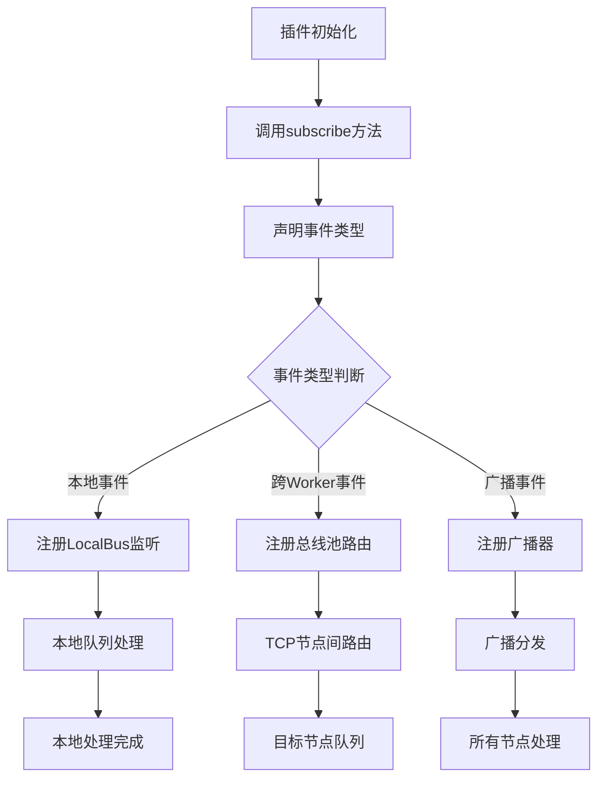

### 对外接口中通信管理接口的设计原因

在 Flask 插件系统中，**消息路由配置** 和 **事件订阅管理** 是通信管理接口的核心设计点。这两个功能的引入直接服务于 **分布式协作、事件驱动架构、资源控制** 三大目标，其背后的设计逻辑可从以下维度深入剖析：

---

#### **一、消息路由配置**
##### **设计原因**
1. **分布式通信的一致性保障**
   - **文档依据**：总线池概念需协调跨 Worker 的通信（[通信总线](file://d:\projects\python\flask_plugins\docs\design\20250601.md#通信总线)）。
   - **目的**：  
     消息路由配置接口提供标准化的 **路径选择机制**（如本地队列、总线池、广播器），确保：
     - **跨 Worker 通信**：主节点维护全局路由表（如 `plugin_A → worker_2`）。
     - **消息去重**：通过哈希+时间窗口+布隆过滤器避免重复路由。
     - **负载均衡**：动态调整路由优先级（如高优先级消息独占队列）。

2. **多层级通信适配**
   - **文档依据**：通信层次分为本地总线、总线池、TCP 通信层（[通信层次](file://d:\projects\python\flask_plugins\docs\design\20250601.md#通信层次)）。
   - **目的**：  
     接口需支持不同隔离级别插件的通信需求：
     - **进程级插件**：通过 TCP 总线池传输。
     - **线程级插件**：共享内存通信（本地总线）。
     - **模块级插件**：直接注入 Flask 上下文（无需路由）。

3. **策略与机制分离**
   - **文档依据**：核心思想强调“基于机制而非策略的设计”（[设计理念](file://d:\projects\python\flask_plugins\docs\design\20250601.md#设计理念)）。
   - **目的**：  
     消息路由配置接口提供 **声明机制**（如插件通过 `priority` 字段声明优先级），而系统的总线池负责 **执行策略**（如高优先级消息插入队列头部）。

4. **热插拔与动态扩展**
   - **文档依据**：热拔插机制需支持插件的动态加载（[核心模块设计](file://d:\projects\python\flask_plugins\docs\design\20250601.md#核心模块设计)）。
   - **目的**：  
     消息路由接口需动态调整通信路径：
     - **新增 Worker**：自动更新路由表，将消息分发至新节点。
     - **插件卸载**：清理路由规则，避免向已卸载插件发送消息。
     - **故障恢复**：主节点故障后重新选举，重建全局通信表。

##### **典型操作**
- **声明路由规则**  
  ```python
  def get_message_routes(self) -> Dict[str, List[str]]:
      # 插件声明消息路由策略（如高优先级消息独占队列）
      return self.metadata.get("routes", {})
  ```
- **执行路由**  
  ```python
  def route_message(self, message: Dict[str, str]) -> None:
      # 根据目标类型选择通信通道（本地/总线池/广播）
      if message["target"] == "broadcast":
          Bus.broadcast(message)
      elif message["target"] == "worker":
          Bus.send_to_worker(message)
      else:
          LocalBus.enqueue(message)
  ```

---

#### **二、事件订阅管理**
##### **设计原因**
1. **事件驱动架构的支持**
   - **文档依据**：通信流程需支持事件类型判断（[通信流程](file://d:\projects\python\flask_plugins\docs\design\20250601.md#通信流程)）。
   - **目的**：  
     事件订阅接口允许插件声明对特定事件的兴趣（如 `cluster_event`），系统按需分发：
     - **本地事件**：仅限当前 Worker 内插件订阅。
     - **广播事件**：所有 Worker 的插件均接收。
     - **跨 Worker 事件**：通过总线池定向传递。

2. **资源控制与隔离**
   - **文档依据**：沙箱代理的隔离级别设计（[隔离级别设计](file://d:\projects\python\flask_plugins\docs\design\20250601.md#隔离级别设计)）。
   - **目的**：  
     事件订阅接口需结合隔离级别动态调整权限：
     - **进程级插件**：仅订阅本地事件（禁止跨进程通信）。
     - **线程级插件**：允许订阅共享内存事件。
     - **模块级插件**：直接绑定 Flask 事件（如 `request_started`）。

3. **生命周期同步**
   - **文档依据**：插件生命周期需建立通信通道（[插件生命周期流程](file://d:\projects\python\flask_plugins\docs\design\20250601.md#插件生命周期流程)）。
   - **目的**：  
     事件订阅接口确保插件在启动时：
     - **自动注册事件监听器**（如插件启动后订阅 `plugin_ready` 事件）。
     - **卸载时取消订阅**（避免残留监听器导致资源泄漏）。

4. **分布式协作效率**
   - **文档依据**：Worker 自发现机制需同步节点状态（[Worker 自发现机制](file://d:\projects\python\flask_plugins\docs\design\20250601.md#worker自发现机制)）。
   - **目的**：  
     事件订阅接口需确保：
     - **跨 Worker 事件同步**：主节点订阅全局状态变更事件，从节点定期拉取更新。
     - **心跳事件管理**：Worker 订阅 `heartbeat` 事件，超时未收到则触发故障恢复。

##### **典型协作流程**


---

#### **三、系统与插件的协作关系**

| **接口功能**         | **协作模块**        | **协作逻辑**                                                                 |
|----------------------|---------------------|-----------------------------------------------------------------------------|
| 消息路由配置         | `Bus.dispatcher`     | 插件声明路由策略，系统按需选择通信通道（如优先级、目标类型）。                   |
| 事件订阅管理         | `Bus.event`          | 插件订阅事件类型，系统按 Worker 角色分发（如主节点处理集群事件）。                |
| 路由优先级           | `Registry.lifecycle`  | 插件声明优先级，系统调整队列顺序（如高优先级插件独占资源）。                     |
| 事件过滤             | `Sandbox.security`   | 系统根据插件权限过滤事件（如禁止未授权插件接收 `admin_event`）。                   |

---

#### **四、设计对比：集中式 vs 协作模式**

| **对比维度**         | **集中式通信管理**                     | **协作模式（当前设计）**                      |
|----------------------|--------------------------------------|--------------------------------------------|
| **路由决策**         | 系统硬编码路由规则                   | 插件声明路由策略，系统按需适配                |
| **事件分发**         | 系统预设所有事件订阅逻辑             | 插件按需订阅事件，系统动态更新路由表           |
| **扩展性**           | 新增通信方式需修改系统核心模块         | 插件自定义路由逻辑（如硬件加速插件使用 RDMA）。 |
| **分布式一致性**     | 系统额外实现 Worker 间路由同步       | 接口提供版本信息，系统同步通信策略             |

---

#### **五、典型场景示例**

1. **高优先级插件的路由配置**  
   - **插件声明**：  
     ```json
     {
         "priority": "high",
         "target": "worker_2"
     }
     ```
   - **系统操作**：  
     - 将消息插入队列头部，优先处理。
     - 通过总线池发送至 `worker_2`，记录追踪 ID。

2. **广播事件的订阅管理**  
   - **插件订阅**：  
     ```python
     def subscribe_to_events(self) -> None:
         Bus.subscribe("cluster_event", self.handle_cluster_event)
     ```
   - **系统操作**：  
     - 广播器维护订阅列表。
     - 主节点收到 `cluster_event` 后向所有从节点分发。

3. **Worker 故障后的路由调整**  
   - **插件卸载**：  
     ```python
     def unsubscribe_from_events(self) -> None:
         Bus.unsubscribe("heartbeat", self.id)
     ```
   - **系统操作**：  
     - 清理无效路由规则。
     - 通知其他节点更新订阅列表。

---

#### **六、设计优势总结**

1. **职责边界清晰**  
   - 插件负责 **声明通信需求**（如优先级、事件类型）。
   - 系统负责 **执行路由策略**（如队列优先级、广播分发）。

2. **灵活性与扩展性**  
   - 插件可自定义路由逻辑（如 AI 插件使用 GPU 加速通信）。
   - 系统无需修改即可支持新通信方式（如 RDMA、WebSocket）。

3. **安全性与稳定性**  
   - 系统强制执行权限验证（如禁止未授权插件访问敏感事件）。
   - 避免资源滥用（如限制插件最大连接数）。

4. **分布式协作效率**  
   - 主节点通过接口同步 Worker 的路由规则。
   - 跨 Worker 通信时选择合适的隔离级别（如进程级插件使用 TCP 而非共享内存）。

---

### **结论**
通信管理接口的设计本质是 **机制与策略分离** 的体现：
- **消息路由配置**：插件声明通信需求（如优先级、目标节点），系统按需适配通信通道（如本地队列、总线池）。
- **事件订阅管理**：插件按需订阅事件类型，系统动态维护订阅列表并分发消息。

这种设计既避免了系统模块因插件逻辑膨胀，又确保了通信的灵活性和系统的可扩展性，完全符合文档中“插件是职责边界”的核心思想（[系统概述](file://d:\projects\python\flask_plugins\docs\design\20250601.md#系统概述)）。