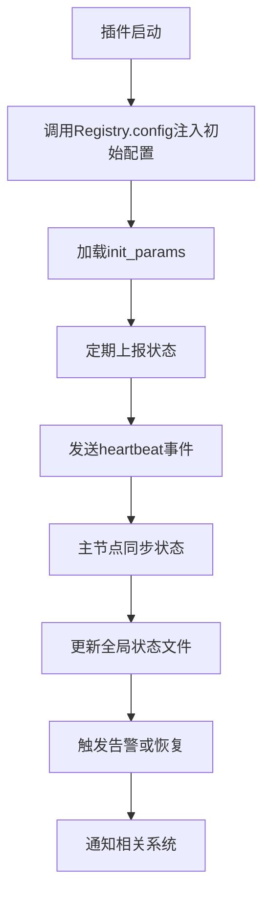

### 对外接口中配置与状态接口的设计原因及与生命周期管理的关系

在 Flask 插件系统中，**配置注入与热更新** 和 **状态上报与监控** 是配置与状态接口的核心设计点。这两个功能的引入直接服务于 **运行时可配置性、分布式协作、故障恢复** 三大目标，其背后的设计逻辑可从以下维度深入剖析：

---

#### **一、配置注入与热更新**
##### **设计原因**
1. **运行时动态调整能力**
   - **文档依据**：插件生命周期的“初始化参数”字段允许运行时配置（[插件元数据结构](file://d:\projects\python\flask_plugins\docs\design\20250601.md#插件元数据结构)）。
   - **目的**：  
     配置注入接口提供标准化的 **动态配置机制**（如插件通过 `init_params` 声明配置需求），系统根据运行时需求：
     - **热更新配置**（如调整插件的 `memory_limit`）。
     - **按需注入参数**（如数据库连接池大小）。
     - **支持多环境**（如开发/生产环境切换）。

2. **多加载方式适配**
   - **文档依据**：插件按加载方式分为内置、动态加载、远程传输等（[按加载方式划分](file://d:\projects\python\flask_plugins\docs\design\20250601.md#按加载方式划分)）。
   - **目的**：  
     不同加载方式的插件需差异化管理配置：
     - **内置插件**：配置固化（如通过 [main.py](file://d:\projects\python\flask_plugins\main.py) 的全局变量）。
     - **动态插件**：运行时动态注入（如通过 `Registry.config` 接口更新）。
     - **远程插件**：支持远程配置推送（如通过 REST 接口更新策略）。

3. **策略与机制分离**
   - **文档依据**：核心思想强调“基于机制而非策略的设计”（[设计理念](file://d:\projects\python\flask_plugins\docs\design\20250601.md#设计理念)）。
   - **目的**：  
     配置注入接口提供 **声明机制**（如插件通过 `config` 字段声明配置需求），而系统的配置中心负责 **执行策略**（如强制限制 `max_connections` 为 10）。

4. **分布式一致性保障**
   - **文档依据**：Worker 自发现机制需同步节点状态（[Worker 自发现机制](file://d:\projects\python\flask_plugins\docs\design\20250601.md#worker自发现机制)）。
   - **目的**：  
     系统通过接口确保：
     - **跨 Worker 配置同步**：主节点推送配置更新至所有从节点。
     - **缓存一致性**：远程插件的配置与本地缓存匹配。

##### **典型操作**
- **声明配置需求**  
  ```python
  def get_config(self) -> Dict[str, Any]:
      return self.metadata.get("config", {})
  ```
- **执行热更新**  
  ```python
  def update_config(self, new_config: Dict[str, Any]) -> None:
      # 调用Registry接口更新配置
      Registry.update_plugin_config(self.id, new_config)
  ```

---

#### **二、状态上报与监控**
##### **设计原因**
1. **健康状态管理**
   - **文档依据**：插件生命周期需维护运行状态（如 `running|stopped|failed`）（[插件生命周期流程](file://d:\projects\python\flask_plugins\docs\design\20250601.md#插件生命周期流程)）。
   - **目的**：  
     状态上报接口允许插件主动报告：
     - **运行状态**（如 CPU 使用率、内存占用）。
     - **异常状态**（如插件崩溃、依赖丢失）。
     - **健康检查结果**（如 `heartbeat` 信号）。

2. **资源使用优化**
   - **文档依据**：沙箱代理的资源限制字段要求声明资源上限（[安全策略配置](file://d:\projects\python\flask_plugins\docs\design\20250601.md#安全策略配置)）。
   - **目的**：  
     状态监控接口需实时记录资源使用情况（如 `resources.cpu_usage`），系统根据状态动态调整：
     - **资源回收**（如终止资源超限的插件）。
     - **负载均衡**（如迁移高负载插件至其他 Worker）。

3. **分布式协作效率**
   - **文档依据**：总线池概念需协调跨 Worker 的资源使用（[通信总线](file://d:\projects\python\flask_plugins\docs\design\20250601.md#通信总线)）。
   - **目的**：  
     状态上报接口确保：
     - **跨 Worker 状态同步**（如主节点维护全局状态表）。
     - **故障检测**（如心跳超时触发 Worker 重选举）。

4. **系统独立性保障**
   - **文档依据**：系统设计核心在于运行机制而非框架（[框架独立性](file://d:\projects\python\flask_plugins\docs\design\20250601.md#框架独立性)）。
   - **目的**：  
     状态监控接口确保系统不依赖 Flask 的请求响应机制，而是通过沙箱代理和总线池实现：
     - **进程级插件**：监控子进程状态（如崩溃后自动重启）。
     - **线程级插件**：跟踪线程活跃度。
     - **模块级插件**：记录模块加载时间。

##### **典型协作流程**


---

#### **三、与生命周期管理接口的协作与差异**

| **接口功能**         | **生命周期管理接口**                          | **配置与状态接口**                          |
|----------------------|---------------------------------------------|---------------------------------------------|
| **配置注入**         | 生命周期初始化阶段加载配置                    | 运行时动态更新配置（如热更新）                |
| **状态管理**         | 生命周期结束时记录状态（如 `stopped`）          | 运行时持续上报状态（如 `heartbeat`）           |
| **职责边界**         | 管理插件的“启动→停止”全过程                  | 管理插件的“运行时行为”                      |
| **典型场景**         | 安装插件时加载默认配置                        | 运行时动态调整资源限制                        |

##### **关键差异点**
1. **生命周期阶段 vs 运行时阶段**  
   - **生命周期管理接口**：负责插件的“出生→死亡”过程（如安装时的配置加载、卸载时的状态清理）。
   - **配置与状态接口**：负责插件的“存活”过程（如热更新配置、持续上报状态）。

2. **静态配置 vs 动态配置**  
   - **生命周期管理接口**：处理插件元数据中的静态配置（如安装时的 `init_params`）。
   - **配置与状态接口**：处理运行时的动态配置（如通过 REST 接口更新 `max_memory`）。

3. **单次操作 vs 持续监控**  
   - **生命周期管理接口**：执行一次性操作（如启动时的 `startup_hooks`）。
   - **配置与状态接口**：持续监控插件状态（如定期发送 `heartbeat`）。

---

#### **四、设计对比：生命周期管理 vs 配置与状态接口**

| **对比维度**         | **生命周期管理接口**                     | **配置与状态接口**                      |
|----------------------|----------------------------------------|----------------------------------------|
| **配置加载**         | 安装时加载 `init_params`                 | 运行时动态更新配置                      |
| **状态记录**         | 记录生命周期状态（如 `stopped`）          | 实时上报运行状态（如 `cpu_usage`）        |
| **扩展性**           | 新增生命周期阶段需修改系统核心模块         | 配置与状态接口可独立扩展（如新增监控指标） |
| **分布式一致性**     | 系统额外实现 Worker 间生命周期同步       | 接口提供版本信息，系统同步配置与状态       |

---

#### **五、典型场景示例**

1. **动态调整插件资源限制**  
   - **插件声明**：  
     ```json
     {
         "resources": {"memory_limit": "512MB"}
     }
     ```
   - **系统操作**：  
     - 启动时注入初始配置（生命周期管理接口）。
     - 运行时通过热更新接口调整为 `1GB`（无需重启插件）。

2. **监控插件健康状态**  
   - **插件上报**：  
     ```python
     def report_status(self) -> None:
         # 上报CPU/内存使用率
         Registry.report_metrics(self.id, {"cpu_usage": "45%", "memory_usage": "512MB"})
     ```
   - **系统操作**：  
     - 主节点维护全局状态表。
     - 触发告警（如 `memory_usage > max_memory`）。

3. **分布式配置同步**  
   - **插件卸载**：  
     ```python
     def unregister_config(self) -> None:
         Registry.remove_plugin_config(self.id)
     ```
   - **系统操作**：  
     - 清理无效配置项。
     - 通知其他节点更新配置缓存。

---

#### **六、设计优势总结**

1. **职责边界清晰**  
   - **生命周期管理接口**：处理插件的“出生→死亡”过程（如安装、卸载）。
   - **配置与状态接口**：处理插件的“存活”过程（如配置更新、状态监控）。

2. **灵活性与扩展性**  
   - **热更新**：插件可自定义配置变更逻辑（如 AI 插件动态调整 GPU 显存）。
   - **状态监控**：系统无需修改即可支持新监控指标（如 GPU 显存占用）。

3. **安全性与稳定性**  
   - **配置验证**：系统强制执行安全策略（如拒绝未声明的权限请求）。
   - **状态恢复**：主节点故障后，从节点通过接口重建状态表。

4. **分布式协作效率**  
   - **主节点同步**：通过接口同步 Worker 的配置与状态。
   - **负载均衡**：根据状态数据迁移插件至低负载节点。

---

### **结论**
配置与状态接口的设计本质是 **运行时可配置性与可观测性** 的体现：
- **配置注入与热更新**：插件声明配置需求，系统按需注入并支持运行时变更。
- **状态上报与监控**：插件持续报告运行状态，系统动态调整资源与故障恢复。

这种设计与生命周期管理接口形成 **阶段互补**：
- **生命周期接口**：管理插件的“启动→关闭”全过程。
- **配置与状态接口**：管理插件的“运行时行为”。

两者共同构建了完整的插件管理闭环，完全符合文档中“插件是职责边界”的核心思想（[系统概述](file://d:\projects\python\flask_plugins\docs\design\20250601.md#系统概述)）。