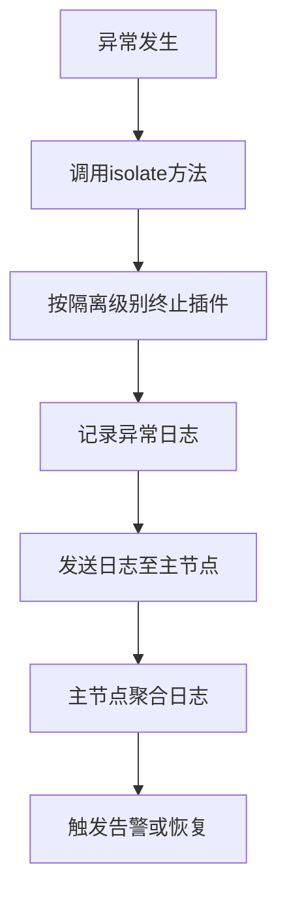

### 对外接口中错误处理接口的设计原因

在 Flask 插件系统中，**异常隔离与恢复** 和 **日志收集** 是错误处理接口的核心设计点。这两个功能的引入直接服务于 **系统稳定性、故障诊断、分布式协作** 三大目标，其背后的设计逻辑可从以下维度深入剖析：

---

#### **一、异常隔离与恢复**
##### **设计原因**
1. **资源隔离与故障隔离**
   - **文档依据**：沙箱代理的隔离级别设计（[沙箱代理](file://d:\projects\python\flask_plugins\docs\design\20250601.md#沙箱代理sandbix-agent)）。
   - **目的**：  
     异常隔离接口提供标准化的 **故障隔离机制**（如插件崩溃后自动终止子进程），确保：
     - **进程级隔离**：插件崩溃不影响主系统（如 `can_spawn_process: false` 防止子进程扩散）。
     - **线程级隔离**：线程异常仅限当前线程（如 GIL 限制下避免全局阻塞）。
     - **模块级隔离**：模块异常仅限当前插件（如 `deny_paths` 阻止文件系统破坏）。

2. **运行时动态恢复**
   - **文档依据**：错误处理流程需支持状态恢复（[错误处理流程](file://d:\projects\python\flask_plugins\docs\design\20250601.md#错误处理流程)）。
   - **目的**：  
     恢复接口需支持插件的 **运行时故障恢复**（如重启失败插件、重新加载依赖）：
     - **自动重启**：检测到 `plugin.status == "failed"` 后自动重启。
     - **依赖修复**：触发依赖解析引擎重新下载缺失的依赖。
     - **状态同步**：主节点清理无效插件记录，通知其他 Worker 更新状态。

3. **策略与机制分离**
   - **文档依据**：核心思想强调“基于机制而非策略的设计”（[设计理念](file://d:\projects\python\flask_plugins\docs\design\20250601.md#设计理念)）。
   - **目的**：  
     异常隔离接口提供 **声明机制**（如插件通过 `permissions` 声明崩溃后的行为），而系统的错误处理模块负责 **执行策略**（如强制终止不可信插件）。

4. **热插拔与动态扩展**
   - **文档依据**：热拔插机制需支持插件的动态加载（[核心模块设计](file://d:\projects\python\flask_plugins\docs\design\20250601.md#核心模块设计)）。
   - **目的**：  
     异常恢复接口需动态处理插件的故障：
     - **内置插件**：重启整个系统（如核心功能插件崩溃）。
     - **远程插件**：重新下载并加载（如网络中断导致的下载失败）。
     - **REST 接口插件**：切换协议适配器（如协议版本不兼容）。

##### **典型操作**
- **隔离异常插件**  
  ```python
  def isolate_plugin(self, plugin_id: str) -> None:
      # 根据插件类型终止进程/线程/模块
      if plugin.sandbox_type == "process":
          os.kill(plugin.pid, signal.SIGTERM)
      elif plugin.sandbox_type == "thread":
          plugin.thread.join(timeout=1)
      else:
          del sys.modules[plugin.name]
  ```
- **执行恢复**  
  ```python
  def recover_plugin(self, plugin_id: str) -> None:
      # 调用Registry接口重新加载插件
      Registry.restart_plugin(plugin_id)
  ```

---

#### **二、日志收集**
##### **设计原因**
1. **故障诊断与调试**
   - **文档依据**：系统启动引导需初始化全局日志（[Engine Bootstrap阶段](file://d:\projects\python\flask_plugins\docs\design\20250601.md#engine-bootstrap阶段)）。
   - **目的**：  
     日志收集接口提供标准化的 **日志记录机制**（如插件通过 `log_level` 声明日志级别），系统按需存储：
     - **本地日志**：Worker 独立记录（如 `worker_1.log`）。
     - **全局日志**：主节点聚合所有 Worker 日志。
     - **结构化日志**：支持 JSON 格式日志便于分析。

2. **分布式协作效率**
   - **文档依据**：Worker 自发现机制需同步节点状态（[Worker 自发现机制](file://d:\projects\python\flask_plugins\docs\design\20250601.md#worker自发现机制)）。
   - **目的**：  
     日志收集接口需确保：
     - **跨 Worker 日志同步**：主节点维护全局日志文件。
     - **异常追踪**：结合 `trace_id` 实现全链路日志追踪。
     - **日志分析**：支持监控系统实时分析日志（如 Prometheus/Grafana）。

3. **安全性与合规性**
   - **文档依据**：安全特性要求记录异常（[安全特性](file://d:\projects\python\flask_plugins\docs\design\20250601.md#安全特性)）。
   - **目的**：  
     日志收集接口需结合权限控制：
     - **敏感日志过滤**：禁止未授权插件记录系统级日志。
     - **日志完整性验证**：防止日志篡改（如哈希校验）。
     - **日志审计**：记录插件的访问行为（如文件读取尝试）。

4. **性能优化与监控**
   - **文档依据**：性能优化需依赖日志数据（[性能优化](file://d:\projects\python\flask_plugins\docs\design\20250601.md#性能优化)）。
   - **目的**：  
     日志收集接口需支持：
     - **资源监控**：记录插件的 CPU/内存使用峰值。
     - **通信效率**：统计消息处理耗时（如 `bus.latency`）。
     - **负载均衡**：根据日志数据迁移高负载插件。

##### **典型协作流程**


---

#### **三、与生命周期管理接口的协作与差异**

| **接口功能**         | **生命周期管理接口**                          | **错误处理接口**                          |
|----------------------|---------------------------------------------|-------------------------------------------|
| **异常隔离**         | 不直接处理异常（仅执行安装/卸载）              | 运行时隔离异常插件（如崩溃后终止子进程）     |
| **状态更新**         | 记录生命周期状态（如 `stopped`）               | 记录运行时状态（如 `failed`）                |
| **日志记录**         | 无直接关联                                   | 提供结构化日志（如异常堆栈、资源使用）        |
| **恢复机制**         | 管理插件的“启动→停止”全过程                  | 管理插件的“运行时故障恢复”                  |

##### **关键差异点**
1. **生命周期阶段 vs 运行时阶段**  
   - **生命周期管理接口**：负责插件的“出生→死亡”过程（如安装、卸载）。
   - **错误处理接口**：负责插件的“存活”过程中的异常处理（如崩溃后隔离）。

2. **静态状态 vs 动态状态**  
   - **生命周期管理接口**：处理插件的静态状态（如 `startup_hooks`）。
   - **错误处理接口**：处理插件的动态状态（如 `heartbeat` 超时）。

3. **单次操作 vs 持续监控**  
   - **生命周期管理接口**：执行一次性操作（如安装时的 `init_params`）。
   - **错误处理接口**：持续监控插件运行状态（如定期检查日志）。

---

#### **四、设计对比：生命周期管理 vs 错误处理接口**

| **对比维度**         | **生命周期管理接口**                     | **错误处理接口**                      |
|----------------------|----------------------------------------|--------------------------------------|
| **异常处理**         | 无直接处理                               | 运行时动态隔离与恢复                   |
| **日志记录**         | 仅记录生命周期事件（如安装/卸载）         | 记录运行时异常、资源使用、通信日志      |
| **扩展性**           | 新增生命周期阶段需修改系统核心模块         | 错误处理接口可独立扩展（如新增告警规则） |
| **分布式一致性**     | 系统额外实现 Worker 间生命周期同步       | 接口提供日志同步，系统聚合全局状态      |

---

#### **五、典型场景示例**

1. **插件崩溃后的隔离与恢复**  
   - **插件声明**：  
     ```json
     {
         "sandbox_type": "process",
         "permissions": ["can_modify_files"]
     }
     ```
   - **系统操作**：  
     - 终止子进程（`os.kill`）。
     - 重新加载插件代码（`Registry.restart_plugin`）。
     - 记录日志（`logger.error("Plugin crashed")`）。

2. **线程级插件的资源超限处理**  
   - **插件上报**：  
     ```python
     def report_status(self) -> None:
         if self.memory_usage > self.max_memory:
             Logger.log(f"Memory limit exceeded: {self.memory_usage}")
     ```
   - **系统操作**：  
     - 主节点聚合日志（`Log Aggregator`）。
     - 触发告警（如 Prometheus 报警）。
     - 迁移插件至低负载 Worker。

3. **分布式日志同步**  
   - **插件卸载**：  
     ```python
     def unregister_logs(self) -> None:
         Logger.remove_plugin_logs(self.id)
     ```
   - **系统操作**：  
     - 清理无效日志项。
     - 通知其他节点更新日志缓存。

---

#### **六、设计优势总结**

1. **职责边界清晰**  
   - **生命周期管理接口**：处理插件的“启动→关闭”全过程。
   - **错误处理接口**：管理插件的“运行时故障隔离与恢复”。

2. **灵活性与扩展性**  
   - **异常隔离**：插件可自定义恢复逻辑（如 AI 插件自动切换模型）。
   - **日志收集**：系统无需修改即可支持新日志格式（如结构化日志）。

3. **安全性与稳定性**  
   - **强制隔离**：系统按沙箱策略终止异常插件。
   - **日志审计**：记录敏感操作（如文件访问尝试）。

4. **分布式协作效率**  
   - **主节点同步**：通过接口同步 Worker 的日志与异常状态。
   - **负载均衡**：根据日志数据迁移插件至低负载节点。

---

### **结论**
错误处理接口的设计本质是 **运行时可观测性与故障恢复能力** 的体现：
- **异常隔离与恢复**：插件声明隔离级别（如进程级），系统按需执行隔离与重启。
- **日志收集**：插件按需记录日志，系统聚合并分析。