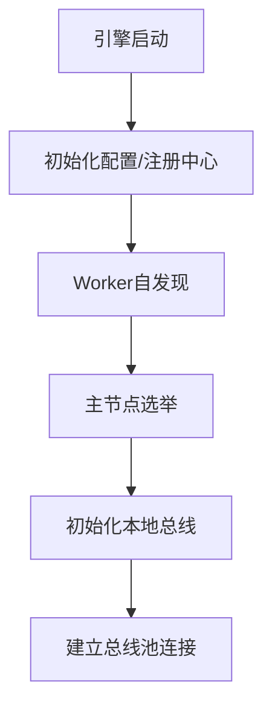
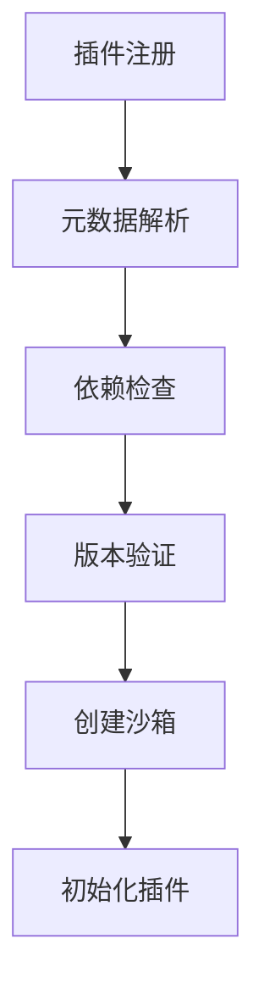
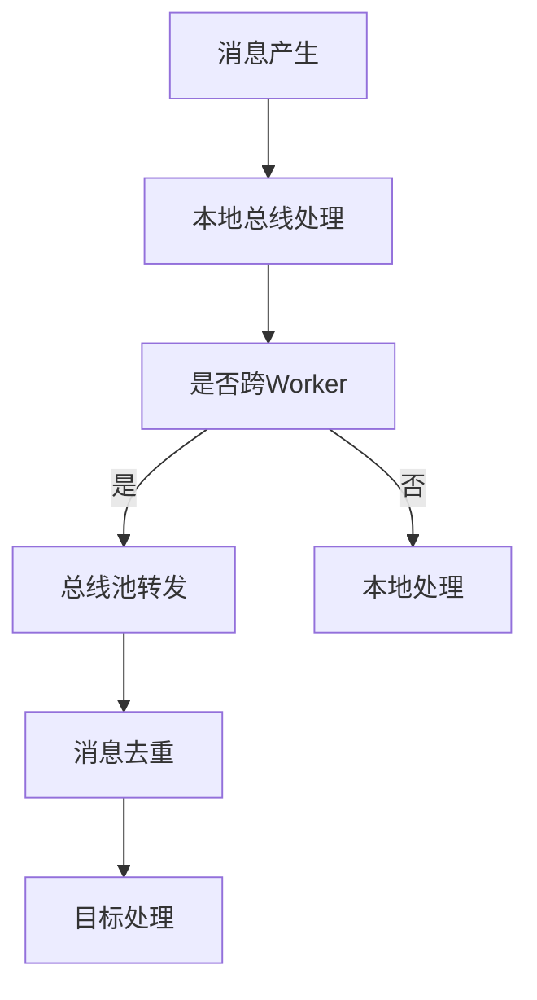

# Flask插件系统设计文档

## 目录

1. [系统概述](#系统概述)
2. [插件分类](#插件分类)
3. [核心模块设计](#核心模块设计)
4. [运行流程](#运行流程)
5. [详细设计](#详细设计)

## 系统概述

本系统设计为一个基于Flask的插件化系统，但核心设计理念不局限于Flask框架。系统的主要目标是提供一个灵活、安全、可扩展的插件运行环境。

### 设计理念

- 插件是职责边界，而非代码位置的划分
- 基于机制而非策略的设计思想
- 保持系统的独立性和可扩展性

### 核心特性

- 灵活的插件加载机制
- 完整的生命周期管理
- 安全的沙箱环境
- 可靠的通信机制
- 分布式运行支持

## 插件分类

### 按职责边界划分

1. **基础设施插件**

   - 提供第三方库的高度复用代码
   - 提供中间件的统一封装
   - 提供通用工具集
2. **框架适配插件**

   - 扩展主框架（如Flask）的能力边界
   - 强绑定、高耦合、全局影响
   - 框架级功能增强
3. **业务能力插件**

   - 提供业务逻辑支撑工具
   - 提供业务通用服务
   - 提供业务集成能力
4. **功能组件插件**

   - 提供运维监控组件
   - 提供测试工具集
   - 提供仪表盘组件
5. **业务封装插件**

   - 可插件化的业务逻辑
   - 业务资源的插件化封装
   - 领域模型的插件化

### 按加载方式划分

1. **内置插件**

   - 随系统启动
   - 最高优先级
   - 不可卸载
2. **静态编码插件**

   - 编译时加载
   - 代码级集成
   - 强依赖关系
3. **动态加载代码文件插件**

   - 运行时扫描
   - 本地文件系统
   - 支持热插拔
4. **动态传输代码文件插件**

   - 远程加载
   - 版本管理
   - 分发机制
5. **REST接口形式插件**

   - 服务化集成
   - 远程调用
   - 协议适配

## 核心模块设计

### 1. 配置/注册中心

#### 职责

- 插件元数据管理
- 插件生命周期管理
- 节点管理和协调
- 配置信息管理

#### 核心功能

- 插件注册和注销
- 配置信息存储和分发
- 节点状态维护
- 生命周期事件管理

### 2. 插件仓库

#### 职责

- 插件包存储管理
- 版本控制
- 缓存管理

#### 存储层次

- 本地仓库（已加载插件）
- 缓存仓库（下载未加载插件）
- 远程仓库（可获取的插件源）

#### 核心功能

- 版本管理机制
- 缓存策略
- 仓库索引
- 完整性校验

### 3. 沙箱代理

#### 隔离级别

1. **进程级隔离**

   - 完全资源隔离
   - 最高安全性
   - 适用于不可信插件
2. **线程级隔离**

   - 共享部分资源
   - 中等安全性
   - 适用于可信但需隔离的插件
3. **模块级隔离**

   - 最轻量级
   - 基础安全性
   - 适用于内置插件

#### 安全特性

- 资源访问控制
- 运行环境隔离
- 权限管理
- 异常处理

### 4. 通信总线

#### 架构设计

- 本地总线（单Worker内通信）
- 总线池（跨Worker通信）
- TCP通信层

#### 核心功能

- 消息路由
- 消息去重
- 状态同步
- 节点协调

### 5. Worker自发现机制

#### 核心组件

- Worker身份识别
- 主节点选举
- 状态同步
- 容错处理

#### 实现机制

- 基于文件系统的节点发现
- 基于文件锁的选举机制
- TCP通信的状态同步
- 心跳检测机制

## 运行流程

### 1. 系统启动流程



### 2. 插件加载流程



### 3. 通信流程



## 详细设计

### 1. 插件元数据结构

```json
{
    "id": "plugin_unique_id",
    "name": "插件名称",
    "version": "1.0.0",
    "type": "业务能力",
    "load_type": "动态加载",
    "dependencies": [],
    "permissions": [],
    "resources": {
        "cpu_limit": "",
        "memory_limit": "",
        "disk_limit": ""
    }
}
```

### 2. 节点信息结构

```json
{
    "node_id": "unique_id",
    "role": "master/slave",
    "start_time": "timestamp",
    "status": "active",
    "plugins": [],
    "resources": {
        "cpu_usage": "",
        "memory_usage": "",
        "load_average": ""
    }
}
```

### 3. 安全策略配置

```json
{
    "sandbox_type": "process/thread/module",
    "file_access": ["allowed_paths"],
    "network_access": {
        "allowed_hosts": [],
        "allowed_ports": []
    },
    "resource_limits": {
        "max_cpu": "",
        "max_memory": "",
        "max_files": ""
    }
}
```

### 4. 通信协议

```json
{
    "message_id": "unique_id",
    "timestamp": "iso_timestamp",
    "source": "node_id",
    "target": "node_id/broadcast",
    "type": "message_type",
    "payload": {},
    "trace_id": "trace_id"
}
```

## 注意事项

1. **安全性考虑**

   - 插件代码隔离
   - 资源访问控制
   - 通信加密
   - 权限管理
2. **性能优化**

   - 缓存策略
   - 资源复用
   - 通信效率
   - 负载均衡
3. **可靠性保证**

   - 故障检测
   - 自动恢复
   - 状态同步
   - 数据一致性
4. **扩展性设计**

   - 接口标准化
   - 模块独立性
   - 版本兼容
   - 平滑升级

## 后续优化方向

1. **功能增强**

   - 插件市场
   - 可视化管理
   - 监控告警
   - 运维工具
2. **性能提升**

   - 并发优化
   - 资源调度
   - 通信效率
   - 缓存策略
3. **可用性提升**

   - 容错机制
   - 备份恢复
   - 灾难恢复
   - 运维自动化

## 推荐目录结构

### 代码目录结构

```
flask_plugins/                     # 项目根目录
├── core/                         # 核心模块
│   ├── registry/                 # 配置/注册中心
│   │   ├── metadata/            # 元数据管理
│   │   ├── lifecycle/           # 生命周期管理
│   │   └── node/                # 节点管理
│   │
│   ├── repository/              # 插件仓库管理代码
│   │   ├── storage/            # 存储管理
│   │   ├── version/            # 版本控制
│   │   └── cache/              # 缓存管理
│   │
│   ├── sandbox/                 # 沙箱代理
│   │   ├── process/            # 进程级隔离
│   │   ├── thread/             # 线程级隔离
│   │   ├── module/             # 模块级隔离
│   │   └── security/           # 安全策略
│   │
│   ├── bus/                     # 通信总线
│   │   ├── event/              # 总线事件
│   │   ├── local/              # 本地总线
│   │   ├── pool/               # 总线池
│   │   └── protocol/           # 通信协议
│   │
│   ├── discovery/               # Worker自发现
│   │   ├── identity/           # 身份识别
│   │   ├── election/           # 主节点选举
│   │   └── sync/               # 状态同步
│   │
│   └── engine/                  # 核心引擎
│       ├── loader/             # 插件加载器
│       └── dispatcher/         # 事件分发器
│
├── interface/                    # 接口定义
│   ├── plugin/                  # 插件接口
│   ├── lifecycle/              # 生命周期接口
│   ├── communication/          # 通信接口
│   └── security/               # 安全接口
│
├── plugins/                      # 内置插件目录
│   ├── builtin/                # 内置插件
│   ├── framework/              # 框架插件
│   ├── business/               # 业务插件
│   └── component/              # 功能组件插件
│
├── utils/                        # 工具类
│   ├── logger/                 # 日志工具
│   ├── config/                 # 配置工具
│   └── helper/                 # 辅助工具
│
├── tests/                        # 测试目录
│   ├── unit/                   # 单元测试
│   ├── integration/            # 集成测试
│   └── e2e/                    # 端到端测试
│
├── docs/                         # 文档
│   ├── design/                 # 设计文档
│   ├── api/                    # API文档
│   └── examples/               # 示例文档
│
├── main.py                       # 主入口
├── setup.py                      # 安装配置
├── requirements.txt              # 依赖管理
├── README.md                     # 项目说明
└── LICENSE                       # 许可证
```

### 实际插件仓库结构

```
{用户目录}/.flask_plugins/        # 用户级插件目录
├── repository/                   # 实际的插件仓库
│   ├── local/                   # 本地仓库
│   │   ├── installed/          # 已安装的插件
│   │   │   ├── plugin_1/      # 插件1
│   │   │   │   ├── 1.0.0/    # 版本1
│   │   │   │   └── 1.0.1/    # 版本2
│   │   │   └── plugin_2/      # 插件2
│   │   │
│   │   └── metadata/          # 元数据存储
│   │       ├── plugins.json   # 插件信息索引
│   │       └── versions.json  # 版本信息索引
│   │
│   ├── cache/                  # 缓存仓库
│   │   ├── downloads/         # 下载的插件包
│   │   └── temp/              # 临时文件
│   │
│   └── state/                  # 状态文件
│       ├── locks/             # 文件锁
│       └── worker/            # Worker状态文件
│
└── config/                      # 用户配置
    ├── plugins.yaml            # 插件配置
    ├── repository.yaml         # 仓库配置
    └── security.yaml           # 安全策略配置

{项目目录}/plugins/              # 项目级插件目录
├── builtin/                    # 内置插件（随项目分发）
└── local/                      # 项目本地插件

/var/lib/flask_plugins/         # 系统级插件目录
├── repository/                 # 系统级仓库
└── shared/                     # 共享资源
```

### 目录结构说明

1. **代码目录特点**

   - 清晰的模块划分
   - 核心功能模块明确分离
   - 接口定义独立管理
   - 插件分类存放
   - 完整的测试和文档支持
2. **实际插件仓库特点**

   - 多级存储策略（用户级/项目级/系统级）
   - 版本管理支持
   - 清晰的元数据组织
   - 完善的缓存机制
   - 状态管理支持
3. **设计优势**

   - 职责划分清晰
   - 扩展性好
   - 维护性高
   - 多环境支持
   - 安全性保障
